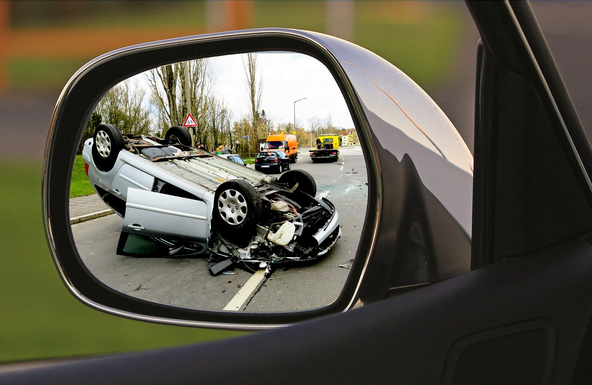

<h1 align="center"><b>Proyecto de Análisis de Siniestros Viales</b></h1>

 

## Descripción

Este proyecto tiene como objetivo utilizar técnicas de análisis de datos para abordar el problema de los siniestros viales en la ciudad de Buenos Aires, Argentina, una de las principales causas de muertes violentas en el país; a partir de datos sobre accidentes de tránsito con victimas mortales, ocurridos entre los años 2016 y 2021.Los archivos de datasets utilizados estan disponibles en los siguientes enlaces:

- [Datasets iniciales](https://data.buenosaires.gob.ar/dataset/victimas-siniestros-viales)
- [Datasets limpios](https://drive.google.com/drive/folders/1QhtL3rnKpi9biMxNFrk4ngEKSsFBeO1O?usp=drive_link)

### Contexto

En Argentina, alrededor de 11 personas por día mueren en accidentes de tránsito, lo que posiciona a los siniestros viales como la principal causa de muerte violenta. Según informes del Sistema Nacional de Información Criminal, entre 2018 y 2022 se registraron 19,630 muertes en siniestros viales en todo el país.

### Objetivo

El objetivo principal de este proyecto es brindar información útil que permita a las autoridades locales tomar medidas efectivas para reducir la cantidad de víctimas mortales en accidentes de tránsito. Se busca identificar patrones, tendencias y factores de riesgo asociados con los siniestros viales utilizando análisis de datos. Además, se definirán tres Key Performance Indicators (KPI) para medir el impacto de las medidas tomadas en la reducción de fallecidos.

### Contenido

- Carpeta [imagenes](https://github.com/maria1289espejo/Analisis_siniestros_viales/tree/main/imagenes): Contiene imágenes y gif del EDA, dashboard o internet.
- Archivo [EDA](https://github.com/maria1289espejo/Analisis_siniestros_viales/blob/main/EDA.ipynb): Archivo jupyter notebook del análisis exploratorio de datos.
- Archivo [dasboard_sniestros_viales](https://github.com/maria1289espejo/Analisis_siniestros_viales/blob/main/dashboard_siniestros_viales.pbix): Archivo de Power BI con tablas, modelo semantico e informe realizado.
- Archivo [.gitignore](https://github.com/maria1289espejo/Analisis_siniestros_viales/blob/main/.gitignore): Archivo que describe la ruta de los archivos y carpetas del proyecto que no estan en el repositorio virtual.

## Tecnologias Usadas

La transformación, limpieza y EDA fueron realizados con Python 3.10.4 en Visual Studio Code 1.86.0. Las librerás utilizadas en cada etapa fueron las siguientes:

- pandas: Lectura de archivos en formato .xlsx y manipulación de dataframe
- numpy: Manipulación de dataframe
- seaborn: Creación de gráficos
- matplotlib.pyplot: Creación de gráficos
- datetime: Manipulación de datos de fecha y hora

El dashboard fue realizado con Power BI 2.124.2028.0, los archivos .gif fueron creados con la aplicación online Canva.

## EDA

Se realizó una exploración inicial de los archivos para identificar la cantidad de filas y columnas, el tipo de datos y la presencia de valores faltantes, nulos, duplicados y únicos. Se llevaron a cabo acciones de limpieza de datos, incluida la corrección, imputación o eliminación de valores inconsistentes, como imputación por moda y reemplazo por cero, entre otras. Posteriormente, se procedió al análisis descriptivo, donde se examinaron las distribuciones y comportamientos de las variables mediante estadísticas resumidas, visualizaciones gráficas y análisis correspondientes. Se generaron archivos con los dataframe limpios en formato .csv para su posterior uso en otras tecnologías. Puede ver esta información de manera detallada en el archivo  [EDA.ipynb](https://github.com/maria1289espejo/Analisis_siniestros_viales/blob/main/EDA.ipynb).

## Dashboard

Se cargaron los dos dataframe limpios en formato .csv, seguidamente se realizó revisión y transformación de los datos, ya que durante el proceso de carga, algunas columnas no quedaron con el formato correspondiente al tipo de datos, y se agregaron algunas filas con datos que no estaban en los archivos .csv. En el modelo los archivos quedaron cargados com las tablas Hechos y victimas.

Luego se creo una tabla llamada Calendario por medio de DAX, con columnas las columnas `Fecha`, `Año`, `Mes` y `dia_semana`. Las formulas DAX utilizadas fueron las siguientes:

`Calendario = CALENDAR(DATE(2016, 1, 1), DATE(2021, 12, 31))`\
`Año = YEAR(Calendario[Fecha])`\
`Semestre = ROUNDUP(Calendario[Mes]/6,0)`\
`Mes = MONTH(Calendario[Fecha])`\
`día_semana = FORMAT(Calendario[Fecha], "DDDD")`\

Una vez creada la tabla Calendario, en la pestaña modelo, se crearon relaciones entre la columna `Fecha` de la tabla Calendario y las columnas `FECHA` de las tablas Hechos y Victimas.

Después se creo la tabla ID_hechos como una tabla puente, con los valores únicos de las columnas `ID` de la tabla Hechos y `ID_hecho`de la tabla Victimas, ya que no se podia relacionar estas dos tablas directamente, porque ambas presentaban valores repetidos en esa columna, la formula DAX utilizada fue:

`ID_hechos = DISTINCT(UNION(VALUES(Hechos[ID]), VALUES(Victimas[ID_hechos])))`\

Se creo un documento .pbix con un informe de 4 paginas: Portada, Sexo y Edad, Ubicación y KPI's, para la página de sexo y edad fue necesario conocer la clasificación de grupos etarios, la cual se consulto en un documento de el Instituto Geográfico Nacional de la República Argentina. Para la página KPI's fue necesario crear y añadir al modelo semantico 3 tablas que contienen los datos, cálculos y medidas requeridas para utilizar las tarjetas KPI y conocer el numero de habitantes de la Ciudad Autonoma de Buenos Aires entre los años 2016 y 2021, esta información se obtuvo del Instituto Nacional de Estadística y Censos INDEC. Los KPI's utlizados fueron:

- Reducción del 10% la tasa de homicidios en siniestros viales de los últimos seis meses, en CABA, en comparación con la tasa de homicidios en siniestros viales del semestre anterior.

- Reducción del 7% la cantidad de accidentes mortales de motociclistas en el último año, en CABA, respecto al año anterior.

- Reducción del 5% la tasa de homicidios de peatones en siniestros viales en el último año, en CABA, respecto al año anterior.

Puede ver esta información de manera detallada en el archivo [dashboard_siniestros_viales.pbix](https://github.com/maria1289espejo/Analisis_siniestros_viales/blob/main/dashboard_siniestros_viales.pbix)

## Análisis y conclusiones

### Sexo y edad

Victimas por sexo a lo largo del tiempo

 

A nivel de dia de la semana, mensual y anual, la mayoria de las victimas son de sexo masculino; los periodos con mayor ocurrencia de accidentes fatales son los dias lunes y sabado, los meses de enero y diciembre y los años 2016 y 2018 para el sexo masculino y los dias miercoles y viernes, los meses de noviembre y diciembre, los años 2018 y 2017, sim embargo no se observa una tendencia de estacionalidad, ya que estas observaciones no se repiten en todos los años evaluados. En ambos sexos se observa reducción en la cantidad de homicidios en el año 2020, esto podría atribuirse a las medidas de restricción de circulación implementadas durante este año debido a un problema de salud pública mundial.

 

 

- Más del 83% de las victimas ocupabam el rol de conductor o peatón lo que sugiere que estos roles son los más vulnerables al momento de ocurrir el accidente.
- La mitad de las victimas de sexo masculino que se desplazaban en moto, auto, bicicleta o vehículos de emergencia tenian alrededor 30 años.
- La totalidad de las victimas de sexo femenino que se dessplazaban como pasajeros de transporte publico pertenecian a la tercera edad.
- Las victimas que se desplazaban como peatones son las que tienen el rango de edad más amplio, mientras las que se desplazaban en vehículos de emergencias presentan el rango de edad mas corto.

 

Las horas con mas accidentes son las 7 y 6 horas, con 42 y 39 resgistros respectivamente, mientras las horas con menos accidentes son las 2 y las 13 horas ambas con 17 registros, esto sugiere que hay mayor ocurrencia en las horas pico de la manaña que en las de la tarde, , lo cual es consistente con el tráfico intenso durante las horas de la mañana cuando las personas se dirigen al trabajo, la escuela u otras actividades.

### Ubicación

 

El tipo de calle más peligroso son las avenidas, las 5 calles más incidencia de accidentes fatales son:

- PAZ GRAL. AV., la mayoría de estas victimas se desplazaban en moto
- RIVADAVIA AV., la mayoría de estas victimas eran peatones
- DEL LIBERTADOR AV., la mayoría de estas victimas se desplazaban en moto
- ALBERTI, JUAN BAUTISTA AV., la mayoría de estas victimas eran peatones
- AUTOPISTA 1 SUR PRESIDENTE ARTURO FRONDIZI, la mayoría de estas victimas se desplazaban en moto

### KPI's

#### Reducción del 10% la tasa de homicidios en siniestros viales de los últimos seis meses, en CABA, en comparación con la tasa de homicidios en siniestros viales del semestre anterior

 

Definido como: (Número de homicidios en siniestros viales / Población total) * 100,000

Métrica: Tasa de homicidios en siniestros viales de los últimos seis meses
Objetivo: Lograr una disminución del 10% en la tasa de homicidios en siniestros viales entre dos semestres consecutivos.

Donde:

Número de homicidios en siniestros viales = Suma de variable `N_VICTIMAS` de la tabla Hechos

Población total =  De acuerdo al documento de población estimada:

| Año     | Población  |
|---------|------------|
| 2016    | 3059122    |
| 2017    | 3063728    |
| 2018    | 3068043    |
| 2019    | 3072029    |
| 2020    | 3075646    |
| 2021    | 3078836    |

#### Reducción del 7% la cantidad de accidentes mortales de motociclistas en el último año, en CABA, respecto al año anterior

 

Definido como: (Número de accidentes mortales con víctimas en moto en el año anterior - Número de accidentes mortales con víctimas en moto en el año actual) / (Número de accidentes mortales con víctimas en moto en el año anterior) * 100

Métrica: Cantidad de accidentes mortales de motociclistas en el último año
Objetivo: Lograr una disminución del 7% en la cantidad de accidentes mortales de motociclistas entre dos años consecutivos.

Donde:

Número de accidentes mortales con víctimas en moto = Suma de variable `N_VICTIMAS` de la tabla Hechos filtrado por la columna victima donde sea igual a `MOTO`.

#### Reducción del 5% la tasa de homicidios de peatones en siniestros viales de los últimos seis meses, en CABA, en comparación con la tasa de homicidios de peatones en siniestros viales del año anterior

 

Definido como: (Número de homicidios de peatones en siniestros viales / Población total) * 100,000

Métrica: Tasa de homicidios en siniestros viales en el último año
Objetivo: Lograr una disminución del 5% en la tasa de homicidios de peatones en siniestros viales entre dos años consecutivos.

Donde:

Número de homicidios de peatones en siniestros viales = Suma de variable `N_VICTIMAS` de la tabla Hechos filtrado por la columna victima donde sea igual a `PEATON`.

Población total =  De acuerdo al documento de población estimada:

| Año     | Población  |
|---------|------------|
| 2016    | 3059122    |
| 2017    | 3063728    |
| 2018    | 3068043    |
| 2019    | 3072029    |
| 2020    | 3075646    |
| 2021    | 3078836    |

### Recomendaciones

- Realizar campañas de educación y prevención con enfasis en los grupos de tipo de vehículo y rol más vulnerables como los motociclistas conductores y peatones.
- Revisar y de ser posible optimizar los limites de velocidad, las señalizaciones, la ubicación de semaforos y/o puentes peatonales en los sitios con mayor ocurrencia de accidnetes con victimas fatales.
- Continuar el monitoreo y seguimiento de los indicadores, para evaluar la efectividad de las medidas implementadas y realizar ajustes de ser necesario.

## Estado del proyecto

En proceso

## Referencias

- **Henry, Proyecto Siniestros Viales.** [https://github.com/soyHenry/PI_DA/blob/Full_Time/README.md](https://github.com/soyHenry/PI_DA/blob/Full_Time/README.md)

- **Seaborn: Statistical Data Visualization**. [https://seaborn.pydata.org/index.html](https://seaborn.pydata.org/index.html) [13-02-2024]

- **Paletas de colores en R.** [https://r-charts.com/es/paletas-colores/#discretas](https://r-charts.com/es/paletas-colores/#discretas) [19-02-2024]

- **Argentina sociodemográfica: Composición de la población.** [https://static.ign.gob.ar/anida/fasciculos/fasc_composicion_poblacion.pdf](https://static.ign.gob.ar/anida/fasciculos/fasc_composicion_poblacion.pdf) [19-02-2024]

- **Población estimada al 1 de julio según año calendario por sexo para el total del país y provincias. Años 2010-2040**[https://sitioanterior.indec.gob.ar/bajarCuadroEstadistico.asp?idc=3C27F61ED1E9AF4EF54A0A2F2226132791F5DBC8DBF2FE4EE4046B03E56D1BEDA2A1D59E52FBA6B3](https://sitioanterior.indec.gob.ar/bajarCuadroEstadistico.asp?idc=3C27F61ED1E9AF4EF54A0A2F2226132791F5DBC8DBF2FE4EE4046B03E56D1BEDA2A1D59E52FBA6B3) [21-02-2024]

- **Imagen accidente vial**[https://pixabay.com/es/photos/accidente-escape-del-conductor-1497295/](https://pixabay.com/es/photos/accidente-escape-del-conductor-1497295/) [21-02-2024]

## Contacto

[Linkedink](https://www.linkedin.com/in/alejandra-monroy-e/)

[Correo](mailto:maria1289espejo@gmail.com)
